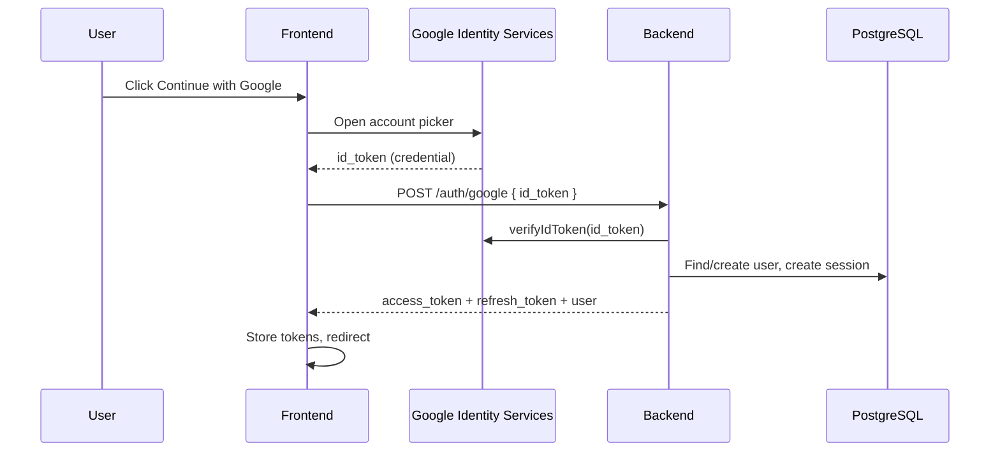
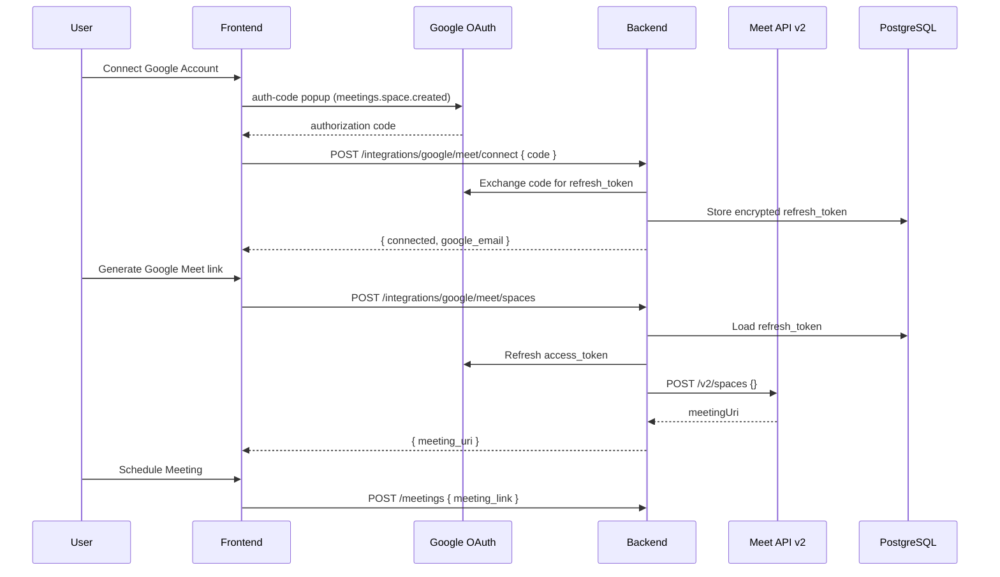

# Google OAuth & Auto-Generated Google Meet Links

Technical documentation for the Prodily Google Sign-In and Google Meet link generation features.

**Repositories**

| Repo | Path |
|------|------|
| Frontend | `Desktop/Frontend-1` |
| Backend | `Desktop/Backend` |

**Last updated:** June 2026  
**Branch context:** Backend `google-oauth`; frontend `dev`

---

## Table of contents

1. [Executive summary](#1-executive-summary)
2. [Architecture overview](#2-architecture-overview)
3. [Google Cloud Console setup](#3-google-cloud-console-setup)
4. [Feature A — Google Sign-In (authentication)](#4-feature-a--google-sign-in-authentication)
5. [Feature B — Auto-generated Google Meet links](#5-feature-b--auto-generated-google-meet-links)
6. [Environment variables](#6-environment-variables)
7. [API reference](#7-api-reference)
8. [Database & storage](#8-database--storage)
9. [Security considerations](#9-security-considerations)
10. [Error handling & edge cases](#10-error-handling--edge-cases)
11. [Local development](#11-local-development)
12. [File index](#12-file-index)
13. [Production checklist](#13-production-checklist)

---

## 1. Executive summary

Two related but **separate** Google integrations were implemented:

| Feature | Purpose | OAuth flow | Token type |
|---------|---------|------------|------------|
| **Google Sign-In** | Login / register into Prodily | Google Identity Services (GIS) credential button | **ID token** (JWT) — verified once, not stored long-term |
| **Google Meet connect** | Auto-generate Meet join links when scheduling | GIS auth-code flow with Meet scope | **Refresh token** — encrypted and stored server-side |

**Key design decision:** Signing in with Google does **not** grant permission to create Meet spaces. Users who want auto-generated Meet links must complete an additional **“Connect Google Account”** step in the Schedule Meeting UI. This allows:

- Email/password users (e.g. `user@yahoo.com`) to connect a personal Gmail for Meet
- Google Sign-In users to connect the same or a different Google account for Meet
- Manual meeting links (Zoom, Teams, pasted URLs) to remain the default path

---

## 2. Architecture overview

### 2.1 Google Sign-In (auth)

```
User clicks "Continue with Google"
  → GIS popup / account picker
  → Browser receives credential (id_token JWT)
  → POST /api/v1/auth/google { id_token, device_info }
  → Backend verifies JWT with google-auth-library (verifyIdToken)
  → Backend creates/links user, issues Prodily JWT + session UUID
  → Frontend stores access_token (Zustand) + refresh_token_id (localStorage)
  → Redirect to dashboard or onboarding (same as email login)
```

### 2.2 Google Meet link generation

```
User opens Schedule Meeting → selects "Google Meet" tab
  → GET /api/v1/integrations/google/meet/status
  → If not connected: "Connect Google Account"
       → GIS auth-code popup (scope: meetings.space.created)
       → POST /api/v1/integrations/google/meet/connect { code }
       → Backend exchanges code for refresh_token, encrypts & stores in DB
  → User clicks "Generate Google Meet link"
       → POST /api/v1/integrations/google/meet/spaces
       → Backend refreshes access_token, calls Meet API createSpace
       → Returns meeting_uri (e.g. https://meet.google.com/abc-defg-hij)
  → User submits schedule form with meeting_link (unchanged meetings API)
       → POST /api/v1/meetings { ..., meeting_link }
```

### 2.3 Why Meet API runs on the backend

- Google Meet REST API (`POST https://meet.googleapis.com/v2/spaces`) requires a Bearer access token with scope `meetings.space.created`
- Refresh tokens must be stored securely (never in the browser)
- Google REST APIs are not intended for direct browser calls (CORS, secret handling)
- The frontend never calls `tokeninfo` or Google's Meet API directly

Reference: [Create and manage meeting spaces](https://developers.google.com/workspace/meet/api/guides/meeting-spaces)

---

## 3. Google Cloud Console setup

### 3.1 OAuth 2.0 Client ID (Web application)

1. Google Cloud Console → **APIs & Services** → **Credentials**
2. Create **OAuth 2.0 Client ID** → type **Web application**
3. **Authorized JavaScript origins** (required):
   - `http://localhost:5714` (local frontend)
   - Production frontend URL (e.g. `https://app.prodily.tech`)
4. **Authorized redirect URIs** for Sign-In / Meet connect:
   - **Leave empty** for GIS Sign-In button flow (ID token)
   - Meet auth-code popup uses the special URI `postmessage` (handled in code, not listed as a redirect URI in Console)

Use the **same Client ID** in frontend and backend. The **client secret** is backend-only.

### 3.2 APIs & scopes

| Item | Required for |
|------|----------------|
| Google Identity Services (enabled by default with OAuth client) | Sign-In + Meet connect UI |
| **Google Meet API** (enable in API Library) | `createSpace` |
| Scope: `openid email profile` (implicit in Sign-In) | Authentication |
| Scope: `https://www.googleapis.com/auth/meetings.space.created` | Meet space creation |

Add the Meet scope on the **OAuth consent screen** under Scopes.

### 3.3 Consent screen

- App name, support email, etc. on **Branding** page
- **Audience**: Testing (add test users) or Production when ready
- **Scopes**: include `meetings.space.created` for Meet link generation

---

## 4. Feature A — Google Sign-In (authentication)

### 4.1 Frontend implementation

**Package:** `@react-oauth/google`

**Provider** — wraps the app when `VITE_GOOGLE_CLIENT_ID` is set:

```text
Frontend-1/src/App.tsx
```

**UI component** — custom-styled “Continue with Google” button; uses hidden GIS `renderButton` to obtain the ID token:

```text
Frontend-1/src/shared/components/oauth.component.tsx
```

Enabled on:

- `src/auth/components/forms/login.form.component.tsx`
- `src/auth/components/forms/register.form.component.tsx`

**API call:**

```text
Frontend-1/src/config/services/auth.service.ts
  → google_login_team_member({ id_token, device_info })
  → POST {SERVER_URL}auth/google
```

**Post-login handling** (shared with email login):

```text
Frontend-1/src/auth/utils/auth-success.utils.ts
  → persistAuthSession()     — Zustand token + localStorage refresh_token_id
  → getPostLoginPath()       — role/onboarding redirect
```

**Error mapping:**

```text
Frontend-1/src/auth/utils/google-auth-error.utils.ts
  → 401: "Google sign-in failed. Please try again."
  → 409: "This email is already linked to another Google account."
  → Network: generic retry message
  → Popup closed: silent reset (no toast)
```

**Token storage (unchanged from email login):**

| Token | Storage | Key / location |
|-------|---------|----------------|
| `access_token` | Zustand in-memory | `auth.store.ts` → `token` |
| `refresh_token` (session UUID) | `localStorage` | `refresh_token_id` |

### 4.2 Backend implementation

**Endpoint:**

```http
POST /api/v1/auth/google
Content-Type: application/json

{
  "id_token": "eyJhbGciOiJSUzI1NiIs...",
  "device_info": "Chrome on Windows"   // optional
}
```

**Files:**

```text
Backend/src/modules/auth/auth.controller.ts   — route handler
Backend/src/modules/auth/auth.service.ts     — googleLogin()
Backend/src/modules/auth/dtos/auths.dto.ts    — GoogleLoginDto
```

**Backend logic (`googleLogin`):**

1. Verify `id_token` with `OAuth2Client.verifyIdToken()` (audience = `GOOGLE_CLIENT_ID`)
2. Read `email`, `sub` (google_id), name, picture from JWT payload
3. Find user by email or `google_id`; create if new
4. Link `google_id` on existing users; handle 409 if email tied to different Google account
5. Mark invited/pre-created users verified when signing in with matching email
6. `establishUserSession()` — same JWT + session UUID as `POST /auth/login`
7. Return `LoginResponseDto` shape (`user`, `access_token`, `refresh_token`)

**Does not:**

- Call `https://www.googleapis.com/oauth2/v3/tokeninfo`
- Store the Google ID token long-term
- Request Meet API scopes

---

## 5. Feature B — Auto-generated Google Meet links

### 5.1 Schedule Meeting UI

**Main form:**

```text
Frontend-1/src/shared/components/schedule-meeting.component.tsx
```

**Meeting link section** (dual mode):

```text
Frontend-1/src/shared/components/meeting-link-section.component.tsx
```

| Mode | UX |
|------|-----|
| **Enter link** | Platform picker (Zoom, Teams, Google Meet, Webex, Other) + manual URL input |
| **Google Meet** | Connection status → Connect → Generate link → read-only URL field |

Form validation (`meeting_link` required in both modes; Google mode requires generate before submit).

**Frontend API service:**

```text
Frontend-1/src/config/services/google-meet.service.ts
```

Uses `@react-oauth/google` `useGoogleLogin` with:

- `flow: 'auth-code'`
- `scope: 'https://www.googleapis.com/auth/meetings.space.created'`

On success, sends `code` to backend `POST .../connect`.

### 5.2 Backend implementation

**Module wiring:**

```text
Backend/src/modules/integrations/integrations.module.ts
  → GoogleMeetController, GoogleMeetService
```

**Controller:**

```text
Backend/src/modules/integrations/google-meet.controller.ts
  @Controller('integrations/google/meet')
  @UseGuards(AuthGuard)
```

**Service:**

```text
Backend/src/modules/integrations/google-meet.service.ts
```

**DTOs / Swagger:**

```text
Backend/src/modules/integrations/dtos/google-meet.dto.ts
```

**Encryption helper (shared pattern):**

```text
Backend/src/helpers/encryption.helper.ts
  → AES-256-GCM, same approach as Fireflies integration
```

#### `GET /status`

Returns whether the current user has a connected Google Meet integration and which `google_email` is stored in metadata.

#### `POST /connect`

1. Receives OAuth `code` from frontend
2. `OAuth2Client.getToken({ code, redirect_uri: 'postmessage' })`
3. Requires `refresh_token` in response (first consent only — see edge cases)
4. Fetches Google email via `https://www.googleapis.com/oauth2/v2/userinfo`
5. Upserts `Integration` row (`provider = google_meet`)
6. Stores encrypted refresh token in `encrypted_api_key`
7. Stores `google_email`, `scopes`, `token_expiry` in `metadata` JSONB

#### `POST /spaces`

1. Loads user's `google_meet` integration
2. Decrypts refresh token
3. `oauthClient.refreshAccessToken()`
4. `POST https://meet.googleapis.com/v2/spaces` with `{}` body
5. Maps response to `{ meeting_uri, meeting_code, space_name }`

Meet API response fields used:

- `meetingUri` → `meeting_uri`
- `meetingCode` → `meeting_code`
- `name` → `space_name` (e.g. `spaces/jQCFfuBOdN5z`)

#### Scheduling the meeting (unchanged)

Generated link is passed to the existing endpoint:

```http
POST /api/v1/meetings
Authorization: Bearer {access_token}

{
  "title": "...",
  "type": "Team Sync",
  "description": "...",
  "date": "2026-06-23",
  "time": "14:30",
  "attendee_emails": ["..."],
  "meeting_link": "https://meet.google.com/abc-defg-hij"
}
```

```text
Backend/src/modules/meetings/meeting.service.ts — scheduleMeeting()
```

---

## 6. Environment variables

### 6.1 Frontend (`Frontend-1/.env`)

| Variable | Example | Purpose |
|----------|---------|---------|
| `VITE_SERVER_URL` | `http://localhost:4000/api/v1/` | API base URL |
| `VITE_GOOGLE_CLIENT_ID` | `xxx.apps.googleusercontent.com` | GIS Sign-In + Meet connect (same as backend) |

**Vite dev server port:** `5714` (`vite.config.ts`)

### 6.2 Backend (`Backend/.env`)

| Variable | Required | Purpose |
|----------|----------|---------|
| `GOOGLE_CLIENT_ID` | Yes | ID token verification + OAuth code exchange |
| `GOOGLE_CLIENT_SECRET` | Yes (Meet) | OAuth code exchange for Meet connect |
| `GOOGLE_OAUTH_REDIRECT_URI` | No (default `postmessage`) | Must match GIS auth-code popup |
| `GOOGLE_MEET_KEY_ENCRYPTION_SECRET` | No | Dedicated encryption key; falls back to `FIREFLIES_KEY_ENCRYPTION_SECRET` or `JWT_ACCESS_SECRET` |
| `JWT_ACCESS_SECRET` | Yes | Session JWT signing + encryption fallback |
| `PORT` | No (default 4000) | Backend listen port |

---

## 7. API reference

### 7.1 Authentication — Google Sign-In

```http
POST /api/v1/auth/google
```

**Request**

```json
{
  "id_token": "eyJhbGciOiJSUzI1NiIs...",
  "device_info": "Chrome on Windows"
}
```

**Success (201)**

```json
{
  "success": true,
  "message": "Successful Google login",
  "data": {
    "user": { "id": "uuid", "email": "...", "user_role": "...", "is_onboarded": true, ... },
    "access_token": "eyJhbGciOiJIUzI1NiIs...",
    "refresh_token": "550e8400-e29b-41d4-a716-446655440000"
  },
  "timestamp": "..."
}
```

**Errors**

| Status | Meaning |
|--------|---------|
| 401 | Invalid/expired Google ID token |
| 409 | Email linked to a different Google account |

### 7.2 Google Meet integration

All routes require `Authorization: Bearer {access_token}`.

#### Status

```http
GET /api/v1/integrations/google/meet/status
```

```json
{
  "success": true,
  "message": "Google Meet connection status retrieved successfully",
  "data": {
    "connected": true,
    "google_email": "user@gmail.com"
  }
}
```

#### Connect

```http
POST /api/v1/integrations/google/meet/connect
```

```json
{ "code": "4/0AeanS..." }
```

Response `data` same shape as status (`connected: true`, `google_email`).

#### Create space

```http
POST /api/v1/integrations/google/meet/spaces
```

```json
{}
```

```json
{
  "success": true,
  "message": "Google Meet link generated successfully",
  "data": {
    "meeting_uri": "https://meet.google.com/abc-defg-hij",
    "meeting_code": "abc-defg-hij",
    "space_name": "spaces/jQCFfuBOdN5z"
  }
}
```

**Errors**

| Status | Meaning |
|--------|---------|
| 401 | Not connected, or refresh token expired |
| 400 | Code exchange failed, Meet API error, missing refresh token |

### 7.3 Standard response envelope

All backend responses use:

```json
{
  "success": boolean,
  "message": string,
  "data": T,
  "meta"?: { "page", "limit", "total", "total_pages" },
  "timestamp": string
}
```

---

## 8. Database & storage

### 8.1 Users (`users` table)

Google Sign-In may set:

- `google_id` — Google `sub` from ID token
- `avatar_url` — from Google profile picture
- `is_verified` / `is_onboarded` — for invited users linking by email

### 8.2 Integrations (`integrations` table)

New provider enum value:

```typescript
IntegrationProvider.GOOGLE_MEET = 'google_meet'
```

```text
Backend/src/entities/integration.entity.ts
```

| Column | Google Meet usage |
|--------|-------------------|
| `provider` | `google_meet` |
| `owner_user_id` | Prodily user who connected |
| `organization_id` | User's org (nullable) |
| `status` | `connected` \| `disconnected` \| `error` |
| `encrypted_api_key` | AES-256-GCM encrypted Google **refresh token** |
| `metadata` | `{ google_email, scopes, token_expiry }` |
| `last_error` | Set when token refresh fails |

Unique index: `(provider, owner_user_id, organization_id)`

In **development**, TypeORM `synchronize: true` applies enum changes automatically. **Production** should run a migration when deploying.

### 8.3 Sessions (`user_sessions` table)

Unchanged — same session UUID as email login, referenced as `refresh_token` in API responses and stored in frontend as `refresh_token_id`.

---

## 9. Security considerations

1. **ID token (auth):** Verified server-side only; never stored; short-lived
2. **Refresh token (Meet):** Encrypted at rest; never sent to frontend
3. **Client secret:** Backend env only; never in frontend bundle
4. **Separate OAuth flows:** Auth ID token ≠ Meet refresh token; least privilege per feature
5. **CORS:** Backend must allow frontend origin (`localhost:5714`, production URL)
6. **Meet links:** Created under the connected Google account; organizer's Google identity hosts the Meet space

---

## 10. Error handling & edge cases

### Google Sign-In

| Scenario | Behavior |
|----------|----------|
| User closes Google popup | Button resets; no error toast |
| Invalid ID token (401) | Banner: "Google sign-in failed. Please try again." |
| Email linked to other Google account (409) | Banner with 409 message |
| Network failure | Generic connection error |
| Invited user signs in with Google | Backend links by email, marks verified |

### Google Meet

| Scenario | Behavior |
|----------|----------|
| Not connected | UI prompts "Connect Google Account" |
| Non-Gmail login (e.g. Yahoo) | Can connect separate Gmail; message shown in UI |
| `VITE_GOOGLE_CLIENT_ID` missing | Google Meet tab shows config message; manual link still works |
| No refresh token on reconnect | Backend 400 — user must revoke app at [Google Account permissions](https://myaccount.google.com/permissions) and reconnect |
| Refresh token expired / revoked | Integration marked `error`; 401 prompts reconnect |
| Generate without connecting | Form validation: "Generate a Google Meet link before scheduling" |

### Important: two Google connections

A user may:

- Sign in to Prodily with `user@company.com` (email/password)
- Connect `personal@gmail.com` for Meet link generation

Or sign in with Google (auth) and connect the same or different account for Meet. These are independent.

---

## 11. Local development

### 11.1 Prerequisites

- PostgreSQL running (backend DB)
- Redis (if using email queue / Bull)
- Google Cloud OAuth client configured (Section 3)
- Google Meet API enabled

### 11.2 Start services

```bash
# Backend (port 4000)
cd Desktop/Backend
# Set GOOGLE_CLIENT_SECRET in .env
npm run start:dev

# Frontend (port 5714)
cd Desktop/Frontend-1
# Set VITE_GOOGLE_CLIENT_ID and VITE_SERVER_URL in .env
npm run dev
```

### 11.3 Test flows

**Sign-In**

1. Open `http://localhost:5714/auth/login`
2. Click **Continue with Google**
3. Complete Google account picker
4. Confirm redirect to dashboard or onboarding

**Meet link**

1. Log in as team lead / HR (roles allowed to schedule)
2. Open Schedule Meeting modal
3. Select **Google Meet** tab
4. **Connect Google Account** → authorize Meet scope
5. **Generate Google Meet link** → URL appears
6. Complete form → **Schedule Meeting**
7. Confirm meeting appears in upcoming meetings with join link

---

## 12. File index

### Frontend (`Desktop/Frontend-1`)

| File | Role |
|------|------|
| `src/App.tsx` | `GoogleOAuthProvider` wrapper |
| `src/shared/components/oauth.component.tsx` | Sign-In button + auth API |
| `src/auth/utils/auth-success.utils.ts` | Shared post-login session + redirect |
| `src/auth/utils/google-auth-error.utils.ts` | Sign-In error messages |
| `src/config/services/auth.service.ts` | `google_login_team_member()` |
| `src/shared/components/meeting-link-section.component.tsx` | Manual vs Meet UI |
| `src/shared/components/schedule-meeting.component.tsx` | Schedule form integration |
| `src/config/services/google-meet.service.ts` | Meet status/connect/spaces API |
| `src/config/services/meeting.service.ts` | `schedule_meeting()` (unchanged) |
| `src/vite-env.d.ts` | `VITE_GOOGLE_CLIENT_ID` types |
| `vite.config.ts` | Dev port 5714 |
| `.env` | Frontend env vars |

### Backend (`Desktop/Backend`)

| File | Role |
|------|------|
| `src/modules/auth/auth.controller.ts` | `POST auth/google` |
| `src/modules/auth/auth.service.ts` | `googleLogin()` ID token verify |
| `src/modules/auth/dtos/auths.dto.ts` | `GoogleLoginDto` |
| `src/modules/integrations/google-meet.controller.ts` | Meet REST routes |
| `src/modules/integrations/google-meet.service.ts` | OAuth exchange + Meet API |
| `src/modules/integrations/dtos/google-meet.dto.ts` | Request/response DTOs |
| `src/modules/integrations/integrations.module.ts` | Module registration |
| `src/entities/integration.entity.ts` | `GOOGLE_MEET` provider |
| `src/helpers/encryption.helper.ts` | Token encryption |
| `src/modules/meetings/meeting.service.ts` | Stores `meeting_link` (unchanged) |
| `.env` | `GOOGLE_CLIENT_ID`, `GOOGLE_CLIENT_SECRET`, etc. |

### Dependencies

| Package | Repo | Purpose |
|---------|------|---------|
| `@react-oauth/google` | Frontend | GIS Sign-In + auth-code for Meet |
| `google-auth-library` | Backend | ID token verify + OAuth token exchange |

---

## 13. Production checklist

- [ ] Add production URL to **Authorized JavaScript origins** in Google Cloud
- [ ] Set `VITE_GOOGLE_CLIENT_ID` and `VITE_SERVER_URL` in frontend production env
- [ ] Set `GOOGLE_CLIENT_ID`, `GOOGLE_CLIENT_SECRET` in backend production env
- [ ] Enable **Google Meet API** in production GCP project
- [ ] Add `meetings.space.created` to OAuth consent screen; publish app when ready
- [ ] Set `GOOGLE_MEET_KEY_ENCRYPTION_SECRET` (recommended; separate from JWT secret)
- [ ] Run DB migration for `IntegrationProvider.GOOGLE_MEET` enum in production
- [ ] Verify CORS allows production frontend origin on backend
- [ ] Smoke test: Sign-In + Connect + Generate + Schedule on staging

---

## Appendix: Sequence diagrams

### A. Google Sign-In



### B. Generate Google Meet link



---

*For questions or changes, refer to Swagger at `http://localhost:4000/api/docs` when the backend is running.*